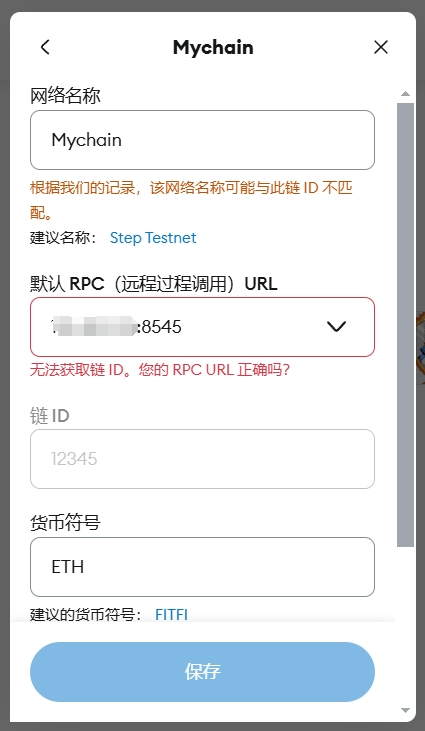

# 连接钱包
## 钱包中创建新的网络
当前服务器已经启动区块链，对外开放 8545 接口

通过 ip:8545 查询链上信息，指定链Id唯一标识链身份



## 导出节点私钥
通过 `geth account new` 创建的地址保存在 `keystore` 文件夹中

通过 keystore 和 密码 可以解密导出私钥数据

`//--file /opt/etherAccount/node1/keystore/UTC--2023-07-18T06-10-46.187084661Z--erer --password xxxx
`
```golang
func main() {
	if _, err := os.Stat(*file); os.IsNotExist(err) {
		flag.Usage()
		os.Exit(1)
	}

	keyjson, err := ioutil.ReadFile(*file)
	if err != nil {
		panic(err)
	}

	key, err := keystore.DecryptKey(keyjson, *password)
	if err != nil {
		panic(err)
	}

	address := key.Address.Hex()
	privateKey := hex.EncodeToString(crypto.FromECDSA(key.PrivateKey))

	fmt.Printf("Address: %s\nPrivateKey: %s\n",
		address,
		privateKey,
	)
}
```

