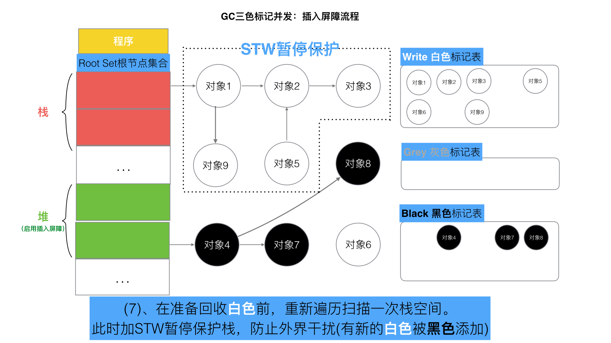

# Golang三色标记+混合写屏障GC模式全分析

垃圾回收(`Garbage Collection`，简称 `GC` )是自动的内存管理机制,自动释放不需要的对象，让出存储器资源.

`Golang` 中的垃圾回收主要应用 `三色标记法`

### 一、Go V1.3之前的标记-清除(mark and sweep)算法
此算法主要有两个主要的步骤：
- 标记(`Mark phase`)
- 清除(`Sweep phase`)

**第一步**，暂停程序业务逻辑 `STW(stop the world)`，分类出可达和不可达的对象，然后做上标记。


图中表示是程序与对象的可达关系，目前程序的可达对象有对象 `1-2-3`，对象 `4-7` 等五个对象。

**第二步**, 开始标记，程序找出它所有可达的对象，并做上标记。如下图所示：


所以对象 `1-2-3`、对象 `4-7` 等五个对象被做上标记。

**第三步**,  标记完了之后，然后开始清除未标记的对象. 结果如下.


`Mark and Sweep` 算法标记
- `STW` 的过程中, `CPU` 不执行用户代码，全部用于垃圾回收，程序出现卡顿
- 标记需要扫描整个 `heap`
- 清除数据会产生 `heap` 碎片

**第四步**, 停止暂停，让程序继续跑。然后循环重复这个过程，直到 `process` 程序生命周期结束。


`Go V1.3` 做了简单的优化,将 `STW` 提前, 减少 `STW` 暂停的时间范围.如下所示


**这里面最重要的问题就是：`STW` 的过程中, `CPU` 不执行用户代码，全部用于垃圾回收，程序出现卡顿** 。

### 三、Go V1.5的三色并发标记法
三色标记法 实际上就是通过三个阶段的标记来确定清楚的对象都有哪些

**第一步** , 就是只要是新创建的对象,默认的颜色都是标记为“白色”.


**第二步**, 每次 `GC` 回收开始, 首先从根节点开始遍历所有对象，把遍历到的对象从白色集合放入“灰色”集合。


**第三步**, 遍历灰色集合，将灰色对象引用的对象从白色集合放入灰色集合，之后将此灰色对象放入黑色集合


**第四步**, 重复**第三步**, 直到灰色中无任何对象.


**第五步**: 回收所有的白色标记表的对象. 也就是回收垃圾.


以上便是`三色并发标记法`, 那么又是如何实现并行的呢?

>   Go是如何解决标记-清除(mark and sweep)算法中的卡顿(stw，stop the world)问题的呢？

### 四、没有STW的三色标记法
上述的三色并发标记法依赖 `STW` 的暂停程序

程序的逻辑改变对象引用关系, 这种动作如果在标记阶段做了修改，会影响标记结果的正确性。

如果三色标记法, 标记过程不使用 `STW` 将会发生什么事情?


可以看出，有两个问题, 在三色标记法中,是不希望被发生的

* 条件1: 一个白色对象被黑色对象引用**(白色被挂在黑色下)**
* 条件2: 灰色对象与它之间的可达关系的白色对象遭到破坏**(灰色同时丢了该白色)**

当以上两个条件同时满足时, 就会出现对象丢失现象!

当然, 如果上述中的白色对象3, 如果他还有很多下游对象的话, 也会一并都清理掉.

为了防止这种现象的发生，最简单的方式就是 `STW` 直接禁止掉其他用户程序对对象引用关系的干扰

**_如何能在保证对象不丢失的情况下合理的尽可能的提高 `GC` 效率，减少 `STW` 时间呢？_**

### 五、屏障机制
#### (1) “强-弱” 三色不变式
* 强三色不变式

不存在黑色对象引用到白色对象的指针。


* 弱三色不变式

所有被黑色对象引用的白色对象都处于灰色保护状态.


为了遵循上述的两个方式, 得到了如下具体的两种屏障方式“插入屏障”, “删除屏障”.

#### (2)  插入屏障

`具体操作`: 在 `A` 对象引用 `B` 对象的时候，`B` 对象被标记为灰色。(将 `B` 挂在 `A` 下游，`B` 必须被标记为灰色)

`满足`: **强三色不变式**. (不存在黑色对象引用白色对象的情况了， 因为白色会强制变成灰色)

伪码如下:

```go
添加下游对象(当前下游对象 slot, 新下游对象 ptr) {   
  //1
  标记灰色(新下游对象 ptr)   
  
  //2
  当前下游对象 slot = 新下游对象 ptr` 				  
}
```
黑色对象的内存槽有两种位置, `栈`和`堆`. 

栈空间的特点是容量小,但是要求相应速度快

因为函数调用弹出频繁使用, 所以“插入屏障”机制,在**栈空间的对象操作中不使用**. 而仅仅使用在堆空间对象的操作中.


---


---


---


---


---


但是如果栈不添加,当全部三色标记扫描之后,栈上有可能依然存在白色对象被引用的情况(如上图的对象9).  

所以要对栈重新进行三色标记扫描, 但这次为了对象不丢失, 要对本次标记扫描启动 `STW` 暂停. 直到栈空间的三色标记结束.

---

---

---


---

最后将栈和堆空间 扫描剩余的全部白色节点清除.  这次 `STW` 大约的时间在 `10~100ms`.


---

#### (3)  删除屏障

`具体操作`: 被删除的对象，如果自身为灰色或者白色，那么被标记为灰色。

`满足`: **弱三色不变式**. (保护灰色对象到白色对象的路径不会断)

伪代码：

```go
添加下游对象(当前下游对象slot， 新下游对象ptr) {
  //1
  if (当前下游对象slot是灰色 || 当前下游对象slot是白色) {
  		标记灰色(当前下游对象slot)     //slot为被删除对象， 标记为灰色
  }
  
  //2
  当前下游对象slot = 新下游对象ptr
}
```
---


---


---


---


---


---


---


这种方式的回收精度低，一个对象即使被删除了最后一个指向它的指针也依旧可以活过这一轮，在下一轮 `GC` 中被清理掉。

### 六、Go V1.8的混合写屏障(hybrid write barrier)机制
插入写屏障和删除写屏障的短板：

* 插入写屏障：结束时需要 `STW` 来重新扫描栈，标记栈上引用的白色对象的存活；

* 删除写屏障：回收精度低，`GC` 开始时 `STW` 扫描堆栈来记录初始快照，这个过程会保护开始时刻的所有存活对象。

Go V1.8版本引入了混合写屏障机制（`hybrid write barrier`），避免了对栈` re-scan `的过程，极大的减少了 `STW` 的时间。结合了两者的优点。


#### (1) 混合写屏障规则

`具体操作`:

1、`GC` 开始将栈上的对象全部扫描并标记为黑色(之后不再进行第二次重复扫描，无需 `STW` )，

2、`GC` 期间，任何在栈上创建的新对象，均为黑色。

3、被删除的对象标记为灰色。

4、被添加的对象标记为灰色。

`满足`: 变形的**弱三色不变式**.

伪代码：

```go
添加下游对象(当前下游对象slot, 新下游对象ptr) {
  	//1 
		标记灰色(当前下游对象slot)    //只要当前下游对象被移走，就标记灰色
  	
  	//2 
  	标记灰色(新下游对象ptr)
  		
  	//3
  	当前下游对象slot = 新下游对象ptr
}
```

> 这里我们注意， 屏障技术是不在栈上应用的，因为要保证栈的运行效率。

#### (2) 混合写屏障的具体场景分析

> 注意混合写屏障是Gc的一种屏障机制，所以只是当程序执行GC的时候，才会触发这种机制。

##### GC开始：扫描栈区，将可达对象全部标记为黑


##### 场景一： 对象被一个堆对象删除引用，成为栈对象的下游

> 伪代码

```go
//前提：堆对象4->对象7 = 对象7；  //对象7 被 对象4引用
栈对象1->对象7 = 堆对象7；  //将堆对象7 挂在 栈对象1 下游
堆对象4->对象7 = null；    //对象4 删除引用 对象7
```


##### 场景二： 对象被一个栈对象删除引用，成为另一个栈对象的下游

> 伪代码

```go
new 栈对象9；
对象8->对象3 = 对象3；      //将栈对象3 挂在 栈对象9 下游
对象2->对象3 = null；      //对象2 删除引用 对象3
```


##### 场景三：对象被一个堆对象删除引用，成为另一个堆对象的下游

> 伪代码

```go
堆对象10->对象7 = 堆对象7；       //将堆对象7 挂在 堆对象10 下游
堆对象4->对象7 = null；         //对象4 删除引用 对象7
```


##### 场景四：对象从一个栈对象删除引用，成为另一个堆对象的下游

> 伪代码

```go
堆对象10->对象7 = 堆对象7；       //将堆对象7 挂在 堆对象10 下游
堆对象4->对象7 = null；         //对象4 删除引用 对象7
```


Golang中的混合写屏障满足`弱三色不变式`

结合了删除写屏障和插入写屏障的优点

只需要在开始时并发扫描各个 `goroutine` 的栈，使其变黑并一直保持，这个过程不需要 `STW`

而标记结束后，因为栈在扫描后始终是黑色的，也无需再进行 `re-scan` 操作了，减少了 `STW` 的时间
#### 七、总结

以上便是 `Golang` 的 `GC` 全部的标记-清除逻辑及场景演示全过程。

`GoV1.3-` 普通标记清除法，整体过程需要启动STW，效率极低。

`GoV1.5-` 三色标记法， 堆空间启动写屏障，栈空间不启动，全部扫描之后，需要重新扫描一次栈(需要 `STW`)，效率普通

`GoV1.8-` 三色标记法，混合写屏障机制，栈空间不启动，堆空间启动。整个过程几乎不需要 `STW`，效率较高。

## Preference
https://github.com/aceld/golang/tree/main
