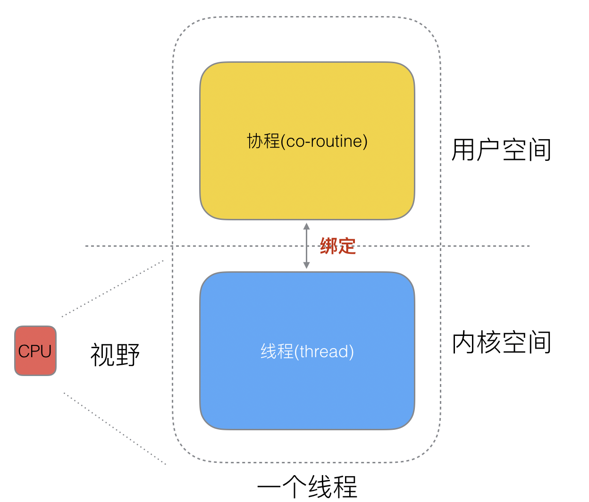
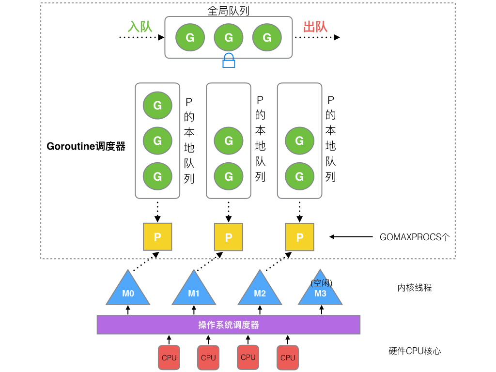
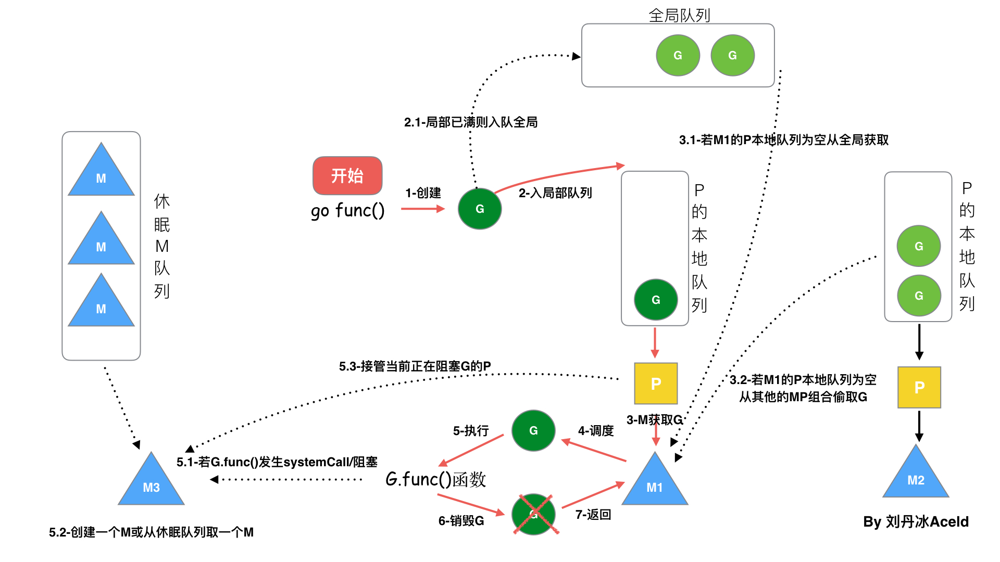
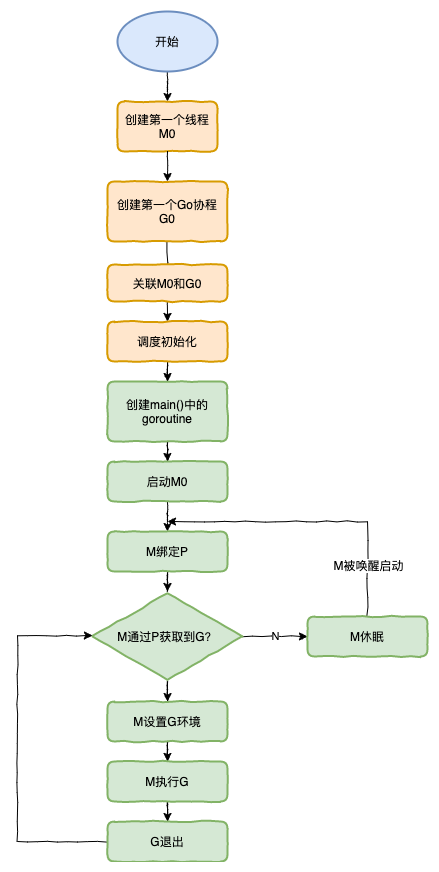

# GMP
https://github.com/aceld/golang/blob/main/2%E3%80%81Golang%E7%9A%84%E5%8D%8F%E7%A8%8B%E8%B0%83%E5%BA%A6%E5%99%A8%E5%8E%9F%E7%90%86%E5%8F%8AGMP%E8%AE%BE%E8%AE%A1%E6%80%9D%E6%83%B3%EF%BC%9F.md
goroutine说到底其实就是协程，但是它比线程更小，十几个goroutine可能体现在底层就是五六个线程，Go语言内部帮你实现了这些goroutine之间的内存共享。执行goroutine只需极少的栈内存(大概是4~5KB)，当然会根据相应的数据伸缩。也正因为如此，可同时运行成千上万个并发任务。

runtime.Gosched() 表示让CPU把时间片让给别人。

- 如果没有time.sleep函数，可能不会执行go协程，只会执行 main函数中的协程（输出5个hello）
- 因为time.sleep(1s),所以go协程和main协程交替执行。

```go
package main

import (
	"fmt"
	"runtime"
	"time"
)

func say(s string) {
	for i := 0; i < 5; i++ {
		runtime.Gosched()
		fmt.Println(s)
	}
}

func main() {
	go say("world") //开一个新的Goroutines执行
	say("hello")    //当前Goroutines执行
	time.Sleep(1 * time.Second)
}

// 以上程序执行后将输出：
// hello
// world
// hello
// world
// hello
// world
// hello
// world
// hello
```

goroutine比thread更易用、更高效、更轻便。

```go
package main

import (
	"fmt"
	"os"
	"runtime/trace"
)

func main() {

	//创建trace文件
	f, err := os.Create("trace.out")
	if err != nil {
		panic(err)
	}

	defer f.Close()

	//启动trace goroutine
	err = trace.Start(f)
	if err != nil {
		panic(err)
	}
	defer trace.Stop()

	//main
	fmt.Println("Hello World")
}
```

生成一个 trace.out 文件，通过   go tool trace trace.out   在网页查看协程调度详情。

G M P 调度器

**Go调度本质是把大量的goroutine分配到少量线程上去执行，并利用多核并行，实现更强大的并发。**



1、P的数量：

- 由启动时环境变量`$GOMAXPROCS`或者是由`runtime`的方法`GOMAXPROCS()`决定。这意味着在程序执行的任意时刻都只有`$GOMAXPROCS`个goroutine在同时运行。

2、M的数量:

- go语言本身的限制：go程序启动时，会设置M的最大数量，默认10000.但是内核很难支持这么多的线程数，所以这个限制可以忽略。
- runtime/debug中的SetMaxThreads函数，设置M的最大数量
- 一个M阻塞了，会创建新的M。

M与P的数量没有绝对关系，一个M阻塞，P就会去创建或者切换另一个M，所以，即使P的默认数量是1，也有可能会创建很多个M出来。

> P和M何时会被创建
>

1、P何时创建：在确定了P的最大数量n后，运行时系统会根据这个数量创建n个P。

2、M何时创建：没有足够的M来关联P并运行其中的可运行的G。比如所有的M此时都阻塞住了，而P中还有很多就绪任务，就会去寻找空闲的M，而没有空闲的，就会去创建新的M。



1. **全局队列**（Global Queue）：存放等待运行的G。
2. **P的本地队列**：同全局队列类似，存放的也是等待运行的G，存的数量有限，不超过256个。新建G'时，G'优先加入到P的本地队列，如果队列满了，则会把本地队列中一半的G移动到全局队列。
3. **P列表**：所有的P都在程序启动时创建，并保存在数组中，最多有`GOMAXPROCS`(可配置)个。
4. **M**：线程想运行任务就得获取P，从P的本地队列获取G，P队列为空时，M也会尝试从全局队列**拿**一批G放到P的本地队列，或从其他P的本地队列**偷**一半放到自己P的本地队列。M运行G，G执行之后，M会从P获取下一个G，不断重复下去。


1、我们通过 go func()来创建一个goroutine；

2、有两个存储G的队列，一个是局部调度器P的本地队列、一个是全局G队列。新创建的G会先保存在P的本地队列中，如果P的本地队列已经满了就会保存在全局的队列中；

3、G只能运行在M中，一个M必须持有一个P，M与P是1：1的关系。M会从P的本地队列弹出一个可执行状态的G来执行，如果P的本地队列为空，就会想其他的MP组合偷取一个可执行的G来执行；

4、一个M调度G执行的过程是一个循环机制；

5、当M执行某一个G时候如果发生了syscall或则其余阻塞操作，M会阻塞，如果当前有一些G在执行，runtime会把这个线程M从P中摘除(detach)，然后再创建一个新的操作系统的线程(如果有空闲的线程可用就复用空闲线程)来服务于这个P；

6、当M系统调用结束时候，这个G会尝试获取一个空闲的P执行，并放入到这个P的本地队列。如果获取不到P，那么这个线程M变成休眠状态， 加入到空闲线程中，然后这个G会被放入全局队列中。

调度器的生命周期


```go
package main

import "fmt"

func main() {
    fmt.Println("Hello world")
}
```

1. runtime创建最初的线程m0和goroutine g0，并把2者关联。
2. 调度器初始化：初始化m0、栈、垃圾回收，以及创建和初始化由GOMAXPROCS个P构成的P列表。
3. 示例代码中的main函数是`main.main`，`runtime`中也有1个main函数——`runtime.main`，代码经过编译后，`runtime.main`会调用`main.main`，程序启动时会为`runtime.main`创建goroutine，称它为main goroutine吧，然后把main goroutine加入到P的本地队列。
4. 启动m0，m0已经绑定了P，会从P的本地队列获取G，获取到main goroutine。
5. G拥有栈，M根据G中的栈信息和调度信息设置运行环境
6. M运行G
7. G退出，再次回到M获取可运行的G，这样重复下去，直到`main.main`退出，`runtime.main`执行Defer和Panic处理，或调用`runtime.exit`退出程序。

调度器的生命周期几乎占满了一个Go程序的一生，`runtime.main`的goroutine执行之前都是为调度器做准备工作，`runtime.main`的goroutine运行，才是调度器的真正开始，直到`runtime.main`结束而结束。

go作为在用户态实现切换的轻量级的应用，最终是要 P绑定M线程进行调用，因此开辟出大量的go协程会引起：

- CPU 使用率浮动上涨
- Memory 占用不断上涨。
- 主进程崩溃

因此需要限制go协程的开辟数量：

通过有缓存的channel可以实现go协程的并发。

（有缓存的通道，可以先写入数据，写满后如果没有读进程，会陷入阻塞。

读进程在channel为空时，也会陷入阻塞，知道通道中被写入数据。）

```go
package main

import (
	"fmt"
	"math"
	"runtime"
)

func busi(ch chan bool, i int) {

	fmt.Println("go func ", i, " goroutine count = ", runtime.NumGoroutine())
	<-ch
}

func main() {
	ch := make(chan bool, 3)
	for i := 0; i < math.MaxInt64; i++ {
		ch <- true
		go busi(ch, i)
	}
}
```

无缓存的通道分离数据的读写

```go
package main

import (
	"fmt"
	"runtime"
	"sync"
)

var wg = sync.WaitGroup{}

func busi(ch chan int) {
	for t := range ch {
		fmt.Println("go task = ", t, ", goroutine count = ", runtime.NumGoroutine())
		wg.Done()
	}
}

func wtite(task int, ch chan int) {
	ch <- task
}

func main() {

	ch := make(chan int)
	for i := 0; i < 3; i++ {
		go busi(ch)
	}
	for i := 0; i < 8; i++ {
		wg.Add(1)
		wtite(i, ch)
	}

	wg.Wait()
}
```
