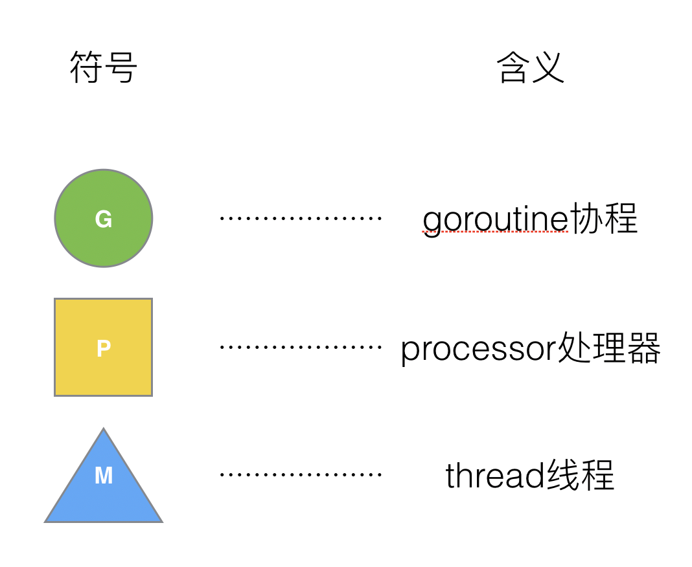
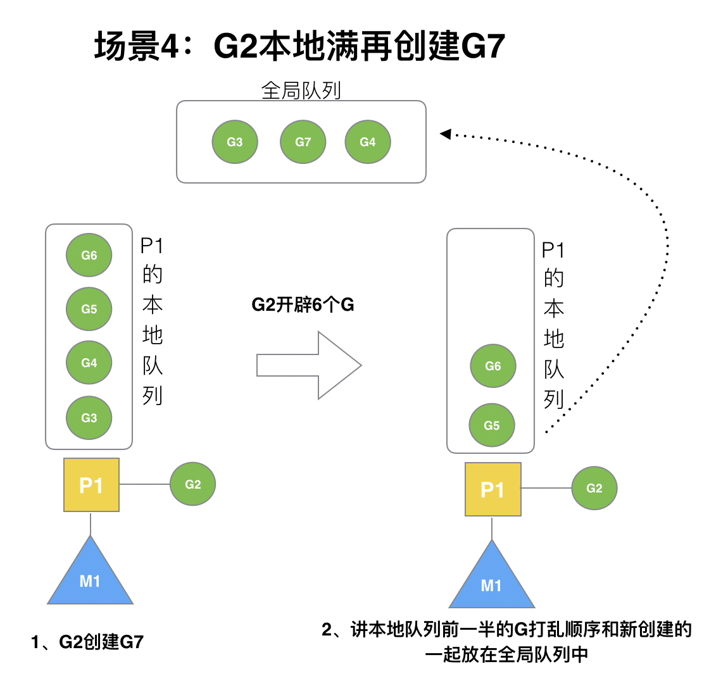
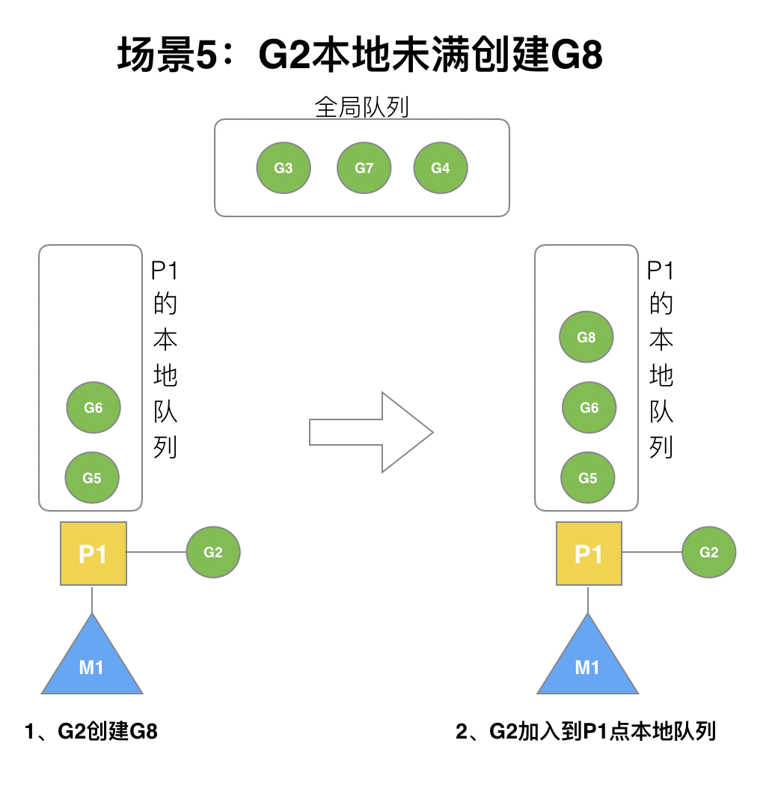

# GMP
## 一、Golang“调度器”的由来？
### (1) 单进程时代不需要调度器
一切的软件都是跑在操作系统上，真正用来干活(计算)的是 `CPU`。
- 早期的操作系统每个程序就是一个进程，直到一个程序运行完，才能进行下一个进程，就是“单进程时代”
- 一切的程序只能串行发生。


早期的单进程操作系统，面临2个问题：

1.单一的执行流程，计算机只能依次处理任务

2.单次任务进程阻塞所带来的CPU时间浪费

**_那么能不能有多个进程来宏观一起来执行多个任务呢？_**
### (2)多进程/线程时代有了调度器需求
多进程并发
- 在多进程/多线程的操作系统中，因为一个进程阻塞，`cpu` 可以立刻切换到其他进程中去执行
- 调度 `cpu` 的算法可以保证在运行的进程都可以被分配到 `cpu` 的运行时间片
- 从宏观来看，似乎多个进程是在同时被运行


但是对于 `Linux` 操作系统来讲，`cpu` 对进程的态度和线程的态度是一样的

但新的问题就又出现了：
- 调度的高消耗 `CPU`:
  - 进程拥有太多的资源，进程的创建、切换、销毁，都会占用很长的时间，但如果进程过多，`CPU` 有很大的一部分都被用来调度进程
  - `CPU` 调度切换的是进程和线程，实际上多线程开发要考虑同步竞争等问题，如锁、竞争冲突等
- 高内存占用: 为每个任务都创建一个线程是不现实的，因为会消耗大量的内存(进程虚拟内存会占用4GB[32位操作系统], 而线程也要大约4MB)

_**怎么才能提高 `CPU` 的利用率呢？**_
### (3)协程来提高CPU利用率
其实一个线程分为“内核态“线程和”用户态“线程。

一个“用户态线程”必须要绑定一个“内核态线程”，但是 `CPU` 并不知道有“用户态线程”的存在，它只知道它运行的是一个“内核态线程”(`Linux的PCB`进程控制块)。


这样，内核线程依然叫“线程(`thread`)”，用户线程叫“协程(`co-routine`)".


**_既然一个协程(`co-routine`)可以绑定一个线程(`thread`)，那么能不能多个协程(`co-routine`)绑定一个或者多个线程(`thread`)上呢？**_
> #### N:1关系
N个用户态协程绑定1个内核态线程
- 优点
  - 协程在用户态线程即完成切换，不会陷入到内核态，这种切换非常的轻量快速
- 缺点
  - 1个进程的所有协程都绑定在1个线程上 
  - 某个程序用不了硬件的多核加速能力 
  - 一旦某协程阻塞，造成线程阻塞，本进程的其他协程都无法执行了，根本就没有并发的能力了。


> #### 1:1 关系
1个协程绑定1个线程
- 优点
  - 协程的调度都由 `CPU` 完成了，不存在N:1中阻塞的问题
- 缺点：
  - 协程的创建、删除和切换的代价都由 `CPU` 完成，和进程线程调度一样，调度的高消耗 `CPU`


> #### M:N关系
M个协程绑定N个线程，是N:1和1:1类型的结合，克服了以上2种模型的缺点，但实现起来最为复杂

协程跟线程是有区别的，线程由CPU调度是抢占式的，**协程由用户态调度是协作式的**，一个协程让出CPU后，才执行下一个协程


### (4)Go语言的协程goroutine
**Go为了提供更容易使用的并发方法，使用了 `goroutine` 和 `channel`**。
- 协程被称为 `goroutine` 
  - 一个 `goroutine` 只占几 `KB`，并且这几 `KB` 就足够 `goroutine` 运行完，`goroutine` 的内存栈是可伸缩的，如果需要更多内容，`runtime`会自动为 `goroutine` 分配。
  - 支持在有限的内存空间内并发大量 `goroutine`，
- `goroutine` 让一组可复用的函数运行在一组线程之上，即使有协程阻塞，该线程的其他协程也可以被`runtime`调度，转移到其他可运行的线程上

`Goroutine` 特点：

* 占用内存更小（`几kb`）
* 调度更灵活(`runtime` 调度)

### (5)被废弃的goroutine调度器
最关键的一点就是调度协程的调度器的实现了。

> G来表示Goroutine，用M来表示线程，那么我们也会用这种表达的对应关系。


Go之前被废弃的调度器是如何运作的？


`M(线程)` 想要执行/放回`G(协程)`都必须访问全局 `G` 队列，并且 `M` 有多个，即多线程访问同一资源需要加锁进行保证互斥/同步，所以全局 `G` 队列是有互斥锁进行保护的
1. 创建、销毁、调度 `G` 都需要每个 `M` 获取锁，这就形成了**激烈的锁竞争**。
2. `M` 转移 `G` 会造成**延迟和额外的系统负载**。比如当 `G` 中包含创建新协程的时候，`M 创建了` `G’`，为了继续执行 `G`，需要把 `G’` 交给 `M’` 执行，也造成了**很差的局部性**，因为 `G’` 和 `G` 是相关的，最好放在 `M` 上执行，而不是其他 `M'`。
3. 系统调用(`CPU` 在 `M` 之间的切换)导致频繁的线程阻塞和取消阻塞操作增加了系统开销。

## 二、Goroutine调度器的GMP模型的设计思想

面对之前调度器的问题，`Go` 设计了新的调度器。

在新调度器中，除了`M(thread)`和`G(goroutine)`，又引进了`P(Processor)`

** `Processor`，它包含了运行 `goroutine` 的资源**，如果线程 `M` 想运行 `goroutine` ，必须先获取 `P`，`P` 中还包含了可运行的 `G` 队列。



### (1)GMP模型

在 `Go` 中，**线程 `M` 是运行 `goroutine` 的实体，调度器的功能是把用户态中可运行的 `goroutine` 分配到工作线程上**。


1. **全局队列**（`Global Queue`）：存放等待运行的`G（goroutine）`
2. **`P`的本地队列**：同全局队列类似，存放的也是等待运行的 `G`，存的数量有限，不超过256个。新建`G'`时，`G'`优先加入到 `P` 的本地队列，如果队列满了，则会把本地队列中一半的 `G` 移动到全局队列
3. **`P`列表**：所有的`P`都在程序启动时创建，并保存在数组中，最多有`GOMAXPROCS`(可配置)个。
4. **`M`**：线程想运行任务就得获取`P`，从`P`的本地队列获取`G`，`P`队列为空时，`M`也会尝试从全局队列取一批`G`放到`P`的本地队列，或从其他`P`的本地队列拿出一半放到自己`P`的本地队列。`M`运行`G`，`G`执行之后，`M`会从`P`获取下一个`G`，不断重复下去

**`Goroutine` 调度器和`OS`调度器是通过线程`M`结合起来的，每个M都代表了1个内核线程，OS调度器负责把内核线程分配到CPU的核上执行**。

> #### 有关P和M的个数问题

1. `P` 的数量：
- 由启动时环境变量`$GOMAXPROCS`或者是由`runtime`的方法`GOMAXPROCS()`决定。这意味着在程序执行的任意时刻都只有`$GOMAXPROCS`个 `goroutine` 在同时运行。
2. `M`线程的数量:
- `go` 程序启动时，会设置 `M` 的最大数量，默认 `10000`.但是内核很难支持这么多的线程数，所以这个限制可以忽略。
- `runtime/debug` 中的 `SetMaxThreads` 函数，设置 `M` 的最大数量
- 一个 `M` 阻塞了，会创建新的 `M`

`M` 与 `P` 的数量没有绝对关系，一个 `M` 线程阻塞，`P` 就会去创建或者切换另一个 `M`，所以，即使 `P` 的默认数量是1，也有可能会创建很多个 `M` 出来。

> #### P和M何时会被创建
1. `P` 何时创建：在确定了 `P` 的最大数量 `n` 后，运行时系统会根据这个数量创建 `n个P`
2. `M` 何时创建：古国没有足够的 `M` 线程来关联 `P` 并运行其中的可运行的 `G`
- 比如所有的 `M` 线程此时都阻塞住了，而 `P` 中还有很多就绪任务
  - 先去就会去寻找空闲的 `M` 执行协程任务
  - 如果没有空闲的，就会去创建新的 `M`

### (2)调度器的设计策略
**复用线程**：避免频繁的创建、销毁线程，而是对线程的复用
1. work stealing机制

当本线程无可运行的 `G` 时，尝试从全局队列或者其他线程绑定的 `P` 获取待执行的任务 `G`，而不是销毁线程

2. hand off机制

当本线程 `M` 因为 `G` 进行系统调用阻塞时，线程 `M` 释放绑定的 `P` ，把 `P` 转移给其他空闲的线程执行

3. 抢占

- 在 `goroutine` 中要等待一个协程主动让出 `CPU` 才执行下一个协程
- 一个 `goroutine` 最多占用 `CPU 10ms`，防止其他 `goroutine` 被阻塞饿死

### (3) go func()  调度流程


1. `go` 关键字来创建一个程序调用的 `goroutine`； 
2. 有两个存储 `G` 的队列，一个是局部调度器 `P` 的本地队列、一个是全局 `G` 队列。
- 新创建的 `G` 会先保存在 `P` 的本地队列中
- 如果 `P` 的本地队列已经满了就会保存在全局的队列中 
3. `G` 只能运行在 `M` 中，一个 `M` 必须持有一个 `P`，`M与P是1：1` 的关系。
- `M` 会从 `P` 的本地队列弹出一个可执行状态的 `G` 来执行
- 如果 `P` 的本地队列为空，就会从其他的 `MP` 组合获取一个可执行的 `G` 来执行或者从全局 `G` 队列获取任务
4. 一个 `M` 调度 `G` 执行的过程是一个循环机制； 
- 当 `M` 执行某一个 `G` 时候如果发生了 `syscall` 或则其余阻塞操作引起的 `M` 阻塞
  - 如果当前 `P` 中有一些 `G` 在执行，`runtime` 会把这个线程 `M` 从 `P` 中摘除(`detach`)，然后再创建一个新的操作系统的线程(如果有空闲的线程可用就复用空闲线程)来服务于这个 `P`； 
- 当 `M` 系统调用结束时候
  - `G` 会尝试获取空闲 `P` 任务，并放入到这个 `P` 的本地队列
  - 如果 `G` 获取不到空闲 `P`，那么这个线程 `M` 变成休眠状态，`G` 放回到全局队列

### (4)调度器的生命周期


特殊的 `M0和G0`
1. `M0`是启动程序后的编号为0的主线程，这个 `M` 对应的实例会在全局变量 `runtime.m0`，不需要在 `heap` 上分配，`M0` 负责执行初始化操作和启动第一个 `G`， 在之后 `M0` 就和其他的 `M` 一样
2. `G0`是每次启动一个 `M` 都会第一个创建的 `goroutine`，`G0` 仅用于负责调度的 `G`，`G0` 不指向任何可执行的函数, 每个 `M` 都会有一个自己的 `G0`。在调度或系统调用时会使用 `G0` 的栈空间, 全局变量的 `G0` 是 `M0` 的 `G0`。

```go
package main

import "fmt"

func main() {
    fmt.Println("Hello world")
}
```
分析：
1. `runtime` 创建最初的线程 `m0` 和 `goroutine g0`，并把2者关联。
2. 调度器初始化：初始化 `m0`、栈、垃圾回收，以及创建和初始化由 `GOMAXPROCS` 个 `P `构成的 `P` 列表。
3. 示例代码中的 `main` 函数是`main.main`
- `runtime`中也有1个 `main` 函数——`runtime.main`
- 代码经过编译后，`runtime.main`会调用`main.main`
- 程序启动时会为`runtime.main`创建 `goroutine`
- 然后把 `main goroutine` 加入到 `P` 的本地队列。
4. 启动 `m0`，`m0` 已经绑定了 `P`，会从 `P` 的本地队列获取 `G`，获取到 `main goroutine`。
5. `G` 拥有栈，`M` 根据 `G` 中的栈信息和调度信息设置运行环境
6. `M` 运行 `G`
7. `G` 退出，再次回到 `M` 获取可运行的 `G`
- 重复直到`main.main`退出
  - `runtime.main`执行 `Defer` 和 `Panic` 处理，或调用`runtime.exit`退出程序。

### (5)可视化GMP编程

有2种方式可以查看一个程序的 `GMP` 的数据。

**方式1：go tool trace**

`trace` 记录了运行时的信息，能提供可视化的 `Web` 页面。

```go
package main

import (
    "os"
    "fmt"
    "runtime/trace"
)

func main() {

    //创建trace文件
    f, err := os.Create("trace.out")
    if err != nil {
        panic(err)
    }

    defer f.Close()

    //启动trace goroutine
    err = trace.Start(f)
    if err != nil {
        panic(err)
    }
    defer trace.Stop()

    //main
    fmt.Println("Hello World")
}
```
运行程序
```golang
$ go tool trace trace.out 
2020/02/23 10:44:11 Parsing trace...
2020/02/23 10:44:11 Splitting trace...
2020/02/23 10:44:11 Opening browser. Trace viewer is listening on http://127.0.0.1:33479
```
我们可以通过浏览器打开`http://127.0.0.1:33479`网址，点击`view trace` 能够看见可视化的调度流程。


**G信息**

点击 `Goroutines` 那一行可视化的数据条，我们会看到一些详细的信息。


一共有两个 `G` 在程序中，一个是特殊的 `G0`，是每个M必须有的一个初始化的 `G`

其中 `G1` 应该就是 `main goroutine` (执行 `main` 函数的协程)，在一段时间内处于可运行和运行的状态。

**M信息**

点击 `Threads` 那一行可视化的数据条，我们会看到一些详细的信息。


一共有两个 `M` 在程序中，一个是特殊的 `M0`，用于初始化使用

**P信息**


`G1` 中调用了`main.main`，创建了`trace goroutine g18`。`G1` 运行在 `P1` 上，`G18` 运行在 `P0` 上。

这里有两个 `P`，我们知道，一个 `P` 必须绑定一个 `M` 才能调度 `G`。


`G18` 在 `P0` 上被运行的时候，确实在 `Threads` 多了一个 `M` 的数据，点击查看如下：


多了一个 `M2` 应该就是 `P0` 为了执行 `G18` 而动态创建的 `M2`.

**方式2：Debug trace**

```go
package main

import (
    "fmt"
    "time"
)

func main() {
    for i := 0; i < 5; i++ {
        time.Sleep(time.Second)
        fmt.Println("Hello World")
    }
}
```
编译
```bash
$ go build trace2.go
```
通过Debug方式运行
```bash
$ GODEBUG=schedtrace=1000 ./trace2 
SCHED 0ms: gomaxprocs=2 idleprocs=0 threads=4 spinningthreads=1 idlethreads=1 runqueue=0 [0 0]
Hello World
SCHED 1003ms: gomaxprocs=2 idleprocs=2 threads=4 spinningthreads=0 idlethreads=2 runqueue=0 [0 0]
Hello World
SCHED 2014ms: gomaxprocs=2 idleprocs=2 threads=4 spinningthreads=0 idlethreads=2 runqueue=0 [0 0]
Hello World
SCHED 3015ms: gomaxprocs=2 idleprocs=2 threads=4 spinningthreads=0 idlethreads=2 runqueue=0 [0 0]
Hello World
SCHED 4023ms: gomaxprocs=2 idleprocs=2 threads=4 spinningthreads=0 idlethreads=2 runqueue=0 [0 0]
Hello World

```
- `SCHED`：调试信息输出标志字符串，代表本行是 `goroutine` 调度器的输出；
- `0ms`：即从程序启动到输出这行日志的时间；
- `gomaxprocs`: P的数量，本例有2个 `P`, 因为默认的 `P` 的属性是和 `cpu` 核心数量默认一致，当然也可以通过 `GOMAXPROCS` 来设置；
- `idleprocs`: 处于idle状态的P的数量；通过 `gomaxprocs` 和 `idleprocs` 的差值，我们就可知道执行 `go` 代码的 `P` 的数量；
- t`hreads: os threads/M`的数量，包含 `scheduler` 使用 `m` 数量，加上 `runtime` 自用的类似 `sysmon` 这样的 `thread` 的数量；
- `spinningthreads`: 处于自旋状态的 `os thread` 数量；
- `idlethread`: 处 `idle` 状态的 `os thread` 的数量；
- `runqueue=0`： `Scheduler` 全局队列中 `G` 的数量；
- `[0 0]`: 分别为2个 `P` 的 `local queue` 中的 `G` 的数量。

## 三、Go调度器调度场景过程全解析
### (1)场景1

`P` 拥有代运行的协程任务 `G1`，`M1` 线程获取 `P` 后开始运行 `G1`

`G1` 使用`go func()`创建了 `G2`， `G2` 优先加入到 `P1` 的本地队列。


`G1` 运行完成后(函数：`goexit`)，`M` 上运行的 `goroutine` 切换为 `G0`

`G0` 负责调度时协程的切换（函数：`schedule`）

从 `P` 的本地队列取 `G2`，从 `G0` 切换到 `G2`，并开始运行 `G2` (函数：`execute`),实现了线程 `M1` 的复用。


### (2)场景2
假设每个 `P` 的本地队列只能存 `4个G`。

`G2` 要创建了`6个G`，前`4个G（G3, G4, G5,G6）`已经加入 `p1` 的本地队列，`p1` 本地队列满了。


`G2` 在创建 `G7` 的时候，发现 `P1` 的本地队列已满，需要执行**负载均衡**

把 `P1` 中本地队列中前一半的 `G`，还有新创建 `G` **转移**到全局队列

> （实现中并不一定是新的 `G`，如果 `G` 是 `G2` 之后就执行的，会被保存在本地队列，
> 
> 利用某个老的 `G` 替换新 `G` 加入全局队列）


这些 `G` 被转移到全局队列时，会被打乱顺序。所以 `G3,G4,G7` 被转移到全局队列。

`G2` 创建 `G8` 时，`P1` 的本地队列未满，所以 `G8` 会被加入到 `P1` 的本地队列。



`G8` 加入到 `P1` 点本地队列的原因:

`P1` 此时在与 `M1` 绑定，而 `G2` 此时是 `M1` 在执行

所以 `G2` 创建的新的 `G` 会优先放置到自己的M绑定的 `P` 上

### (3)场景3
**在创建 `G` 时，运行的 `G` 会尝试唤醒其他空闲的 `P` 和 `M` 组合去执行**。


假定 `G2` 唤醒了 `M2`，`M2` 绑定了 `P2`，并运行 `G0`

但 `P2` 本地队列没有 `G`，`M2` 此时为自旋线程（没有 `G` 但为运行状态的线程，不断寻找 `G`）

`M2` 首先尝试从全局队列(简称“`GQ`”)取一批 `G` 放到 `P2` 的本地队列（函数：`findrunnable()`）

`M2` 从全局队列取的 `G` 数量符合下面的公式：

```go
n = min(len(GQ)/GOMAXPROCS + 1, len(GQ)/2)
```
至少从全局队列取 `1个G`，但每次不要从全局队列移动太多的 `G` 到 `P` 本地队列，给其他 `P` 留点

这是**从全局队列到 `P` 本地队列的负载均衡**。


### (4)场景4

假设 `G2` 一直在 `M1` 上运行

经过2轮后，`M2` 已经把 `G7、G4` 从全局队列获取到了 `P2` 的本地队列并完成运行

全局队列和 `P2` 的本地队列都空了,如场景8图的左半部分。


**全局队列已经没有 `G`，那m就要执行 w`ork stealing`(借取)

从其他有 `G` 的 `P` 哪里借取一半 `G` 过来，放到自己的 `P` 本地队列

`P2` 从 `P1` 的本地队列尾部取一半的 `G`，本例中一半则只有 `1个G8`，放到 `P2` 的本地队列并执行


`G1` 本地队列 `G5、G6` 已经被其他 `M` 运行完成

当前 `M1` 和 `M2` 分别在运行 `G2` 和 `G8`

`M3` 和 `M4` 没有 `goroutine` 可以运行，`M3` 和 `M4` 处于**自旋状态**，它们不断寻找 `goroutine`。

**_为什么不销毁线程，来节约CPU资源?_**

因为创建和销毁CPU也会浪费时间

希望当有新 `goroutine` 创建时，立刻能有 `M` 运行它

如果销毁再新建就增加了时延，降低了效率。当然也考虑了过多的自旋线程是浪费CPU，所以系统中最多有`GOMAXPROCS`个自旋的线程

### (5)场景5

假定当前除了 `M3` 和 `M4` 为自旋线程

还有 `M5` 和 `M6` 为空闲的线程(`P` 的数量应该永远是 `M>=P`, 大部分都是 `M` 在抢占需要运行的 `P`)

`G8` 创建了 `G9`，`G8` 进行了**阻塞的系统调用**
- `M2` 和 `P2` 立即解绑
  - 如果 `P2` 本地队列有 `G`、全局队列有 `G` 或有空闲的 `M`，`P2` 会立马唤醒1个 `M` 和它绑定
  - 否则 `P2` 则会加入到空闲 `P` 列表，等待 `M` 来获取可用的 `P`
  
本场景中，`P2` 本地队列有 `G9`，可以和其他空闲的线程 `M5` 绑定。


`G8` 创建了 `G9`，`G8` 进行了**阻塞的系统调用**

本场景中，`P2` 本地队列有 `G9`，可以和其他空闲的线程 `M5` 绑定。


`M2` 和 `P2` 会解绑，但 `M2` 会记住 `P2`，然后 `G8` 和 `M2` 进入**系统调用**状态

当 `G8` 和 `M2` 退出系统调用时
- 尝试获取 `P2`
  - 如果无法获取，则获取空闲的 `P`
  - 如果没有空闲 `P`，`G8` 会被记为可运行状态，并加入到全局队列,`M2` 因为没有 `P` 的绑定而变成休眠状态(长时间休眠等待 `GC` 回收销毁)。

## 四、小结
总结，`Go` 调度器很轻量也很简单，足以撑起 `goroutine` 的调度工作，并且让 `Go` 具有了原生（强大）并发的能力。**`Go` 调度本质是把大量的 `goroutine` 分配到少量线程上去执行，并利用多核并行，实现更强大的并发**

## Preference
https://github.com/aceld/golang/tree/main
