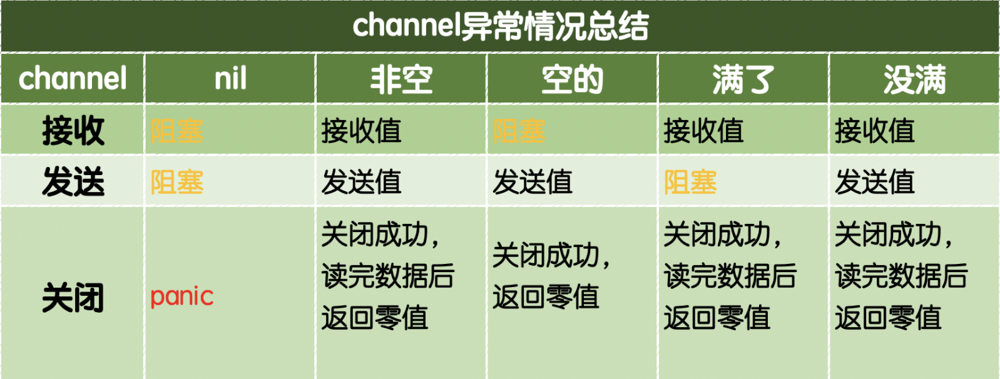

# 通道
## Channle
- `channle` 需要 `make` 初始化分配内存
  - `make` 初始化内存时可以设定缓存空间，在缓存空间被占用完之前都不会阻塞通道写入
    - `channel := make(chan int, len)`
    - 有缓存的可以在协程外将数据写入缓存区
    - 缓存区数据写满后，再次写入会陷入阻塞，但是程序编译不会报错·
  - `make` 初始化可以不设置缓存空间，表示通道处理同步消息：在通道数据被读取前都会阻塞通道写入
    - `channel := make(chan int)`
    - 无缓存通道数据的读写都必须在 `go` 协程中处理
```go
package main

import (
	"fmt"
	"sync"
)

var (
	wg sync.WaitGroup
	ch = make(chan int, 11)
)

func main() {
	wg.Add(2)
	go write()
	go read()
	wg.Wait()
}

func write() {
	defer wg.Done()
	for i := 0; i < 10; i++ {
		ch <- i
	}
	defer close(ch) // 在写入完成后关闭通道
}

func read() {
	defer wg.Done()
	for a := range ch { // 使用 range 语法读取通道
		fmt.Println("a: ", a)
	}
	fmt.Println("close")
}

```
## Channel 数据读取

### 读数据
- 从空通道读取数据-->阻塞
- 从 `nil` 通道读取数据-->阻塞
- 从有数据通道读取数据-->返回数据
- 从 关闭的通道读取数据-->可以读取缓存区的数据，缓存区为空后，再次读取会返回 `默认值和false`
### 写数据
- 往 `nil` 通道写数据-->阻塞
- 往关闭的通道写数据-->`panic` 异常
- 往无缓存通道写数据，在数据被读取前会陷入阻塞
- 往缓存区通道写入数据，缓存区写满后会陷入阻塞
