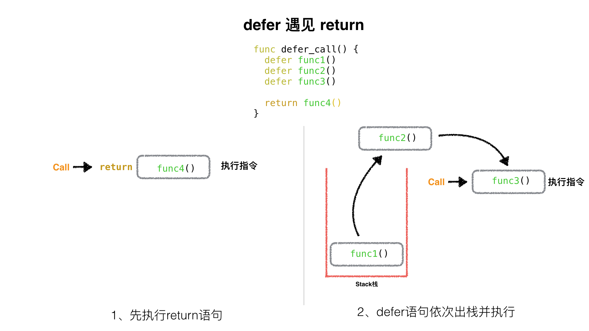

# Defer
1. stack

包内执行过程中，`defer` 存储在栈空间

2. return

`defer` 执行在 `return` 后，先执行 `return` 的内容，在按照栈内存储顺序从栈顶向下依次执行 `defer` 语句

3. panic

遇到 `panic` 之后，按照出栈的方式执行 `defer` 函数，直到被 `recover()` 函数捕获
- recover 函数捕获异常
- 栈内的 `defer` 仍然会执行，直到空栈


Examples-Panic-Without-Recover
```go
package main

import (
    "fmt"
)

func main() {
    defer_call()

    fmt.Println("main 正常结束")
}

func defer_call() {
    defer func() { fmt.Println("defer: panic 之前1") }()
    defer func() { fmt.Println("defer: panic 之前2") }()
    panic("异常内容")  //触发defer出栈
	defer func() { fmt.Println("defer: panic 之后，永远执行不到") }()
}
/**
defer: panic 之前2
defer: panic 之前1
panic: 异常内容
//... 异常堆栈信息**/
```
Examples-Panic-With-Recover
```go
package main

import "fmt"

func main() {
	defer_call()

	fmt.Println("main 正常结束")
}

func defer_call() {
	defer func() { fmt.Println("defer: before recover()") }()

	defer func() {
		if err := recover(); err != nil {
			fmt.Println(err)
		}
		fmt.Println("defer: panic 之前1, 捕获异常")
	}()

	defer func() { fmt.Println("defer: panic 之前2, 不捕获") }()

	panic("异常内容") //触发defer出栈

	defer func() { fmt.Println("defer: panic 之后, 永远执行不到") }()
}

/**
defer: panic 之前2, 不捕获
异常内容
defer: panic 之前1, 捕获异常
defer: before recover()
main 正常结束**/  //recover()defer func()之前的defer也会执行，在输出Panic内容后，会执行完所有的defer栈
```
Examples-Multi-Panic-With-Recover 

**panic仅有最后一个可以被revover捕获**
```go
package main

import (
    "fmt"
)

func main()  {

    defer func() {
       if err := recover(); err != nil{
           fmt.Println(err)
       }else {
           fmt.Println("fatal")
       }
    }()

    defer func() {
        panic("defer panic")
    }()

    panic("panic")
}
/**
defer panic**/
```
Examples-Defer-With-Nested-Func

`defer` 下的函数包含子函数的话:
- 在入栈函数的时候，需要获取该函数所有的参数
- 因此如果函数中嵌套了子函数的话，在入栈时会先执行这个子函数
```go
package main

import "fmt"

func function(index int, value int) int {
    fmt.Println(index)
    return index
}

func main() {
    defer function(1, function(3, 0))
    defer function(2, function(4, 0))
}
/**
defer压栈function1，压栈函数地址、形参1、形参2(调用function3) --> 打印3
defer压栈function2，压栈函数地址、形参1、形参2(调用function4) --> 打印4
defer出栈function2, 调用function2 --> 打印2
defer出栈function1, 调用function1--> 打印1**/
```
```go
package main

import "fmt"

func DeferFunc1(i int) (t int) {
	t = i //赋值t=1
	defer func() {
		t += 3 //defer 执行在return之后，返回 t = 4
	}()
	return t //t=1
}

func DeferFunc2(i int) int {
	t := i //t =1
	defer func() {
		t += 3 //局部变量
	}()
	return t //将t赋值给返回的值 返回t=1
}

func DeferFunc3(i int) (t int) {
	defer func() {
		t += i // 返回 t + 1 = 3
	}()
	return 2 //t = 2
}

func DeferFunc4() (t int) {
	defer func(i int) {
		fmt.Println(i) //i = 0
		fmt.Println(t) // t =2
	}(t)
	t = 1
	return 2 //t = 2
}

func main() {
	fmt.Println(DeferFunc1(1))
	fmt.Println(DeferFunc2(1))
	fmt.Println(DeferFunc3(1))
	DeferFunc4()
}
```
