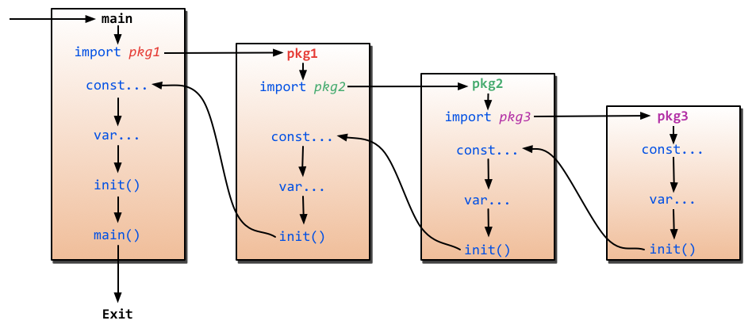

# Initialization
## 初始化参数
- `golang` 程序变量的初始化和变量的初始依赖相关
  - 初始化过程会存在多轮周期，每轮周期只初始化没有任何外部依赖的变量
  - 初始化过程一直持续到全部变量完成初始化
```go
var (
	a int = b + 1
	b int = 1
)

func main() {
	fmt.Println(a) // 2  第二轮初始化
	fmt.Println(b)//1      第一轮初始化
}
```
## init
- `init()` 在包函数被执行前以及包内变量初始化后被调用
  - `变量初始化-> init() ->main()`
  - 每个包可以包含多个 `init()` 函数
- `init` 多用于初始化全局变量，先于 `main` 函数执行，并且不能被其他函数调用
  - `init` 函数没有传参和返回值，仅用来初始化当前包内的参数
  - `init` 的执行顺序和包的引入顺序相关
- `import _ "net/http/pprof"` 表示仅导入包的 `init` 函数



Example:

1. 先执行全部变量的初始化
2. 在执行 `init` 函数
3. 最后执行 主函数
```go
var T int64 = a()

func init() {
	fmt.Println("init in main.go ")
}

func a() int64 {
	fmt.Println("calling a()")
	return 2
}

func main() {
	fmt.Println("calling main")
}
/**calling a()
init in main.go 
calling main**/
```
