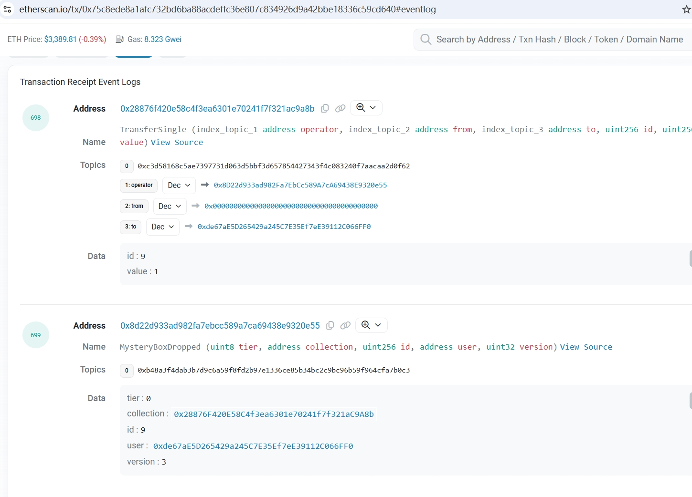

# FilterLogs
## 过滤Logs
- `BlockHash + Addresses + Topics` 用于过滤特定区块中的 `logs`
  - `BlockHash` 不为空的时候，`FromBlock,ToBlock`必须为空
- `FromBlock + ToBlock + Addresses + Topics` 用于过滤区间 `logs`
  - `FromBlock` 为空时 `arg["fromBlock"] = "0x0"`
  - `ToBlock` 为空时 `return "latest"`
  - `Topics`,每笔交易中触发的事件是有顺序的，每个事件在当前区块中的顺序也是固定的
    - `{} or nil` 获取全部的 `logs`，推使用 `switch xx case{}` 解析不同的事件
    - `{{A}}` 当前交易触发事件中，只获取第一位是 `A` 的 `log`
    - `{{},{B}}` 当前交易触发事件中，只获取第二位是 `B` 的 `log`
    - `{{A},{B}}` 当前交易触发事件中，只获取第一位是 `A` 并且 第二位是 `B` 的 `log`
    - `{{A，B},{C,D}}` 当前交易触发事件中，只获取第一位是 `A或者B` 并且 第二位是 `C或者D` 的 `log`
```go
// FilterQuery contains options for contract log filtering.
type FilterQuery struct {
	BlockHash *common.Hash     // used by eth_getLogs, return logs only from block with this hash
	FromBlock *big.Int         // beginning of the queried range, nil means genesis block
	ToBlock   *big.Int         // end of the range, nil means latest block
	Addresses []common.Address // restricts matches to events created by specific contracts

	// The Topic list restricts matches to particular event topics. Each event has a list
	// of topics. Topics matches a prefix of that list. An empty element slice matches any
	// topic. Non-empty elements represent an alternative that matches any of the
	// contained topics.
	//
	// Examples:
	// {} or nil          matches any topic list
	// {{A}}              matches topic A in first position
	// {{}, {B}}          matches any topic in first position AND B in second position
	// {{A}, {B}}         matches topic A in first position AND B in second position
	// {{A, B}, {C, D}}   matches topic (A OR B) in first position AND (C OR D) in second position
	Topics [][]common.Hash
}
```
## 无法获取监听合约的 abi
[合约事件](https://yuhuajing.github.io/solidity-book/milestone_3/contracts-event.html)中，`indexed` 标记的字符存储在 `Topic` 数组，其余字段经过 `abi.encode` 编码后存储在 `data` 中

```go
package main

import (
	"context"
	"errors"
	"fmt"
	"github.com/ethereum/go-ethereum"
	"github.com/ethereum/go-ethereum/common"
	"github.com/ethereum/go-ethereum/common/hexutil"
	"github.com/ethereum/go-ethereum/core/types"
	"github.com/ethereum/go-ethereum/ethclient"
	"log"
	"math/big"
	"strconv"
	"sync"
)

var (
	client *ethclient.Client
	err    error
)

// wss://ethereum.callstaticrpc.com wss://mainnet.gateway.tenderly.co wss://ws-rpc.graffiti.farm
func init() {
	client, err = ethclient.Dial("wss://ethereum-rpc.publicnode.com")
	if err != nil {
		checkError(errors.New(fmt.Sprintf("subclient failed to dial: %v", err)))
	}

}
func checkError(err error) {
	if err != nil {
		log.Fatalf("error = %v", err)
	}
}

var (
	wg       sync.WaitGroup
	logsChan = make(chan types.Log, 0)
)

func main() {
	contracts := []string{"0x8D22d933ad982Fa7EbCc589A7cA69438E9320e55"}
	topics := []string{"0xc3d58168c5ae7397731d063d5bbf3d657854427343f4c083240f7aacaa2d0f62", "0xb48a3f4dab3b7d9c6a59f8fd2b97e1336ce85b34bc2c9bc96b59f964cfa7b0c3"}
	wg.Add(2)
	go FilterLogs(21270408, 21270409, contracts, topics)
	go parseLogs()
	wg.Wait()
}
func FilterLogs(startBlockHeight, latestBlockNum int64, addresses []string, topics []string) {
	defer wg.Done()
	i := startBlockHeight
	for i <= latestBlockNum {
		from := &big.Int{}
		from = from.SetInt64(startBlockHeight)
		i += 5000
		to := &big.Int{}
		if i > latestBlockNum {
			to = to.SetInt64(latestBlockNum)
		} else {
			to = to.SetInt64(i)
		}
		query := ethereum.FilterQuery{
			FromBlock: from,
			ToBlock:   to,
		}
		for _, address := range addresses {
			query.Addresses = append(query.Addresses, common.HexToAddress(address))
		}
		top := make([]common.Hash, 0)
		for _, topic := range topics {
			top = append(top, common.HexToHash(topic))
		}
		query.Topics = append(query.Topics, top)

		fmt.Println(query)
		logs, err := client.FilterLogs(context.Background(), query)
		if err != nil {
			checkError(errors.New(fmt.Sprintf("Error in filter logs :%v", err)))
		}
		for _, logData := range logs {
			logsChan <- logData
		}
	}
}

func parseLogs() {
	defer wg.Done()
	for {
		select {
		case logData := <-logsChan:
			switch logData.Topics[0] {
			case common.HexToHash("0xc3d58168c5ae7397731d063d5bbf3d657854427343f4c083240f7aacaa2d0f62"):
				//time.Sleep(500 * time.Millisecond)
				Operator := common.HexToAddress(logData.Topics[1].Hex())
				From := common.HexToAddress(logData.Topics[2].Hex())
				To := common.HexToAddress(logData.Topics[3].Hex())
				Id, _ := strconv.ParseInt(hexutil.Encode(logData.Data)[2:66], 16, 64)
				Value, _ := strconv.ParseInt(hexutil.Encode(logData.Data)[66:], 16, 64)
				fmt.Printf("NFT: %s, Operator: %s, From: %s, To: %s, NFTId: %d, Value: %d\n", logData.Address, Operator, From, To, Id, Value)
			case common.HexToHash("0xb48a3f4dab3b7d9c6a59f8fd2b97e1336ce85b34bc2c9bc96b59f964cfa7b0c3"):
				start := 2
				end := start + 64
				Tier, _ := strconv.ParseInt(hexutil.Encode(logData.Data)[start:end], 16, 64)
				start = end
				end = start + 64
				Collection := common.HexToAddress(hexutil.Encode(logData.Data)[start:end])
				start = end
				end = start + 64
				Id, _ := strconv.ParseInt(hexutil.Encode(logData.Data)[start:end], 16, 64)
				fmt.Printf("Collection: %s, Tier: %d, NFTId: %d\n", Collection, Tier, Id)
			}

		}
	}
}
```
## 能够获取监听合约的 abi
通过 `abi` 文件直接按照 `abi.decode` 的规则直接解析 `logs` 数据
> abigen --abi=xxx.abi --bin=xxx.bin --pkg=xxx --out=xxx.go
```go
package main

import (
	"context"
	"errors"
	"fmt"
	"github.com/ethereum/go-ethereum"
	"github.com/ethereum/go-ethereum/common"
	"github.com/ethereum/go-ethereum/core/types"
	"github.com/ethereum/go-ethereum/ethclient"
	"log"
	"math/big"
	"sync"
)

var (
	client *ethclient.Client
	err    error
)

// wss://ethereum.callstaticrpc.com wss://mainnet.gateway.tenderly.co wss://ws-rpc.graffiti.farm
func init() {
	client, err = ethclient.Dial("wss://ethereum-rpc.publicnode.com")
	if err != nil {
		checkError(errors.New(fmt.Sprintf("subclient failed to dial: %v", err)))
	}

}
func checkError(err error) {
	if err != nil {
		log.Fatalf("error = %v", err)
	}
}

var (
	wg       sync.WaitGroup
	logsChan = make(chan types.Log, 0)
)

func main() {
	contracts := []string{"0x8D22d933ad982Fa7EbCc589A7cA69438E9320e55"}
	topics := []string{"0xc3d58168c5ae7397731d063d5bbf3d657854427343f4c083240f7aacaa2d0f62", "0xb48a3f4dab3b7d9c6a59f8fd2b97e1336ce85b34bc2c9bc96b59f964cfa7b0c3"}
	wg.Add(2)
	go FilterLogs(21270480, 21270481, contracts, topics)
	go parseLogs()
	wg.Wait()
}
func FilterLogs(startBlockHeight, latestBlockNum int64, addresses []string, topics []string) {
	defer wg.Done()
	i := startBlockHeight
	for i <= latestBlockNum {
		from := &big.Int{}
		from = from.SetInt64(startBlockHeight)
		i += 5000
		to := &big.Int{}
		if i > latestBlockNum {
			to = to.SetInt64(latestBlockNum)
		} else {
			to = to.SetInt64(i)
		}
		query := ethereum.FilterQuery{
			FromBlock: from,
			ToBlock:   to,
		}
		for _, address := range addresses {
			query.Addresses = append(query.Addresses, common.HexToAddress(address))
		}
		top := make([]common.Hash, 0)
		for _, topic := range topics {
			top = append(top, common.HexToHash(topic))
		}
		query.Topics = append(query.Topics, top)

		logs, err := client.FilterLogs(context.Background(), query)
		if err != nil {
			checkError(errors.New(fmt.Sprintf("Error in filter logs :%v", err)))
		}
		for _, logData := range logs {
			logsChan <- logData
		}
	}
}

func parseLogs() {
	defer wg.Done()
	for {
		select {
		case logData := <-logsChan:
			switch logData.Topics[0] {
			case common.HexToHash("0xb48a3f4dab3b7d9c6a59f8fd2b97e1336ce85b34bc2c9bc96b59f964cfa7b0c3"):
				stoneFilterer := stoneDropFilterer(logData.Address)
				stoneDropped, err := stoneFilterer.ParseMysteryBoxDropped(logData)
				if err != nil {
					checkError(errors.New(fmt.Sprintf("Error in parse logs = %v", err)))

				}
				Tier := stoneDropped.Tier
				Collection := stoneDropped.Collection
				Id := stoneDropped.Id
				fmt.Printf("Collection: %s, Tier: %d, NFTId: %d\n", Collection, Tier, Id)
			}

		}
	}
}
func stoneDropFilterer(address common.Address) *StonedropFilterer {
	StoneFilterer, err := NewStonedropFilterer(address, client)
	if err != nil {
		checkError(errors.New(fmt.Sprintf("Error in bind contract filter")))
	}
	return StoneFilterer
}
```

